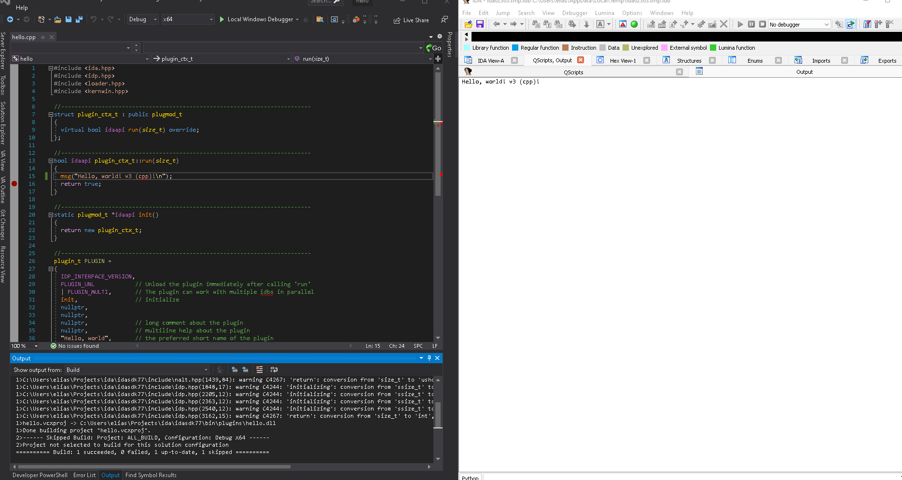

# What is QScripts?

QScripts is productivity tool and an alternative to IDA's "Recent scripts" (Alt-F9) and "Execute Scripts" (Shift-F2) facilities. QScripts allows you to develop and run any supported scripting language (\*.py; \*.idc, etc.) from the comfort of your own favorite text editor as soon as you save the active script, the trigger file or any of its dependencies.


Video tutorials on the [AllThingsIDA](https://www.youtube.com/@allthingsida) YouTube channel:

- [Boost your IDA programming efficiency tenfold using the ida-qscripts productivity plugin](https://youtu.be/1UEoLAgEGMc?si=YMieIKHEY0AXgMHU)
- [Scripting concepts and productivity tips for IDAPython & IDC](https://youtu.be/RgHmwHN0NLk?si=OCnLMhcAmHAQPgNI)
- [An exercise in netnodes with the snippet manager plugin](https://youtu.be/yhVdLYzFJW0?si=z3xMqCEFOU89gAkI)

# Usage

Invoke QScripts from the plugins menu, press Ctrl-3 or its default hotkey Alt-Shift-F9.
When it runs, the scripts list might be empty. Just press `Ins` and select a script to add, or press `Del` to delete a script from the list.
QScripts shares the same scripts list as IDA's `Recent Scripts` window.

To execute a script, just press `ENTER` or double-click it. After running a script once, it will become the active script (shown in **bold**).

An active script will then be monitored for changes. If you modify the script in your favorite text editor and save it, then QScripts will execute the script for you automatically in IDA.

To deactivate a script, just press `Ctrl-D` or right-click and choose `Deactivate script monitor` from the QScripts window. When an active script becomes inactive, it will be shown in *italics*.

There are few options that can be configured in QScripts. Just press `Ctrl+E` or right-click and select `Options`:

* Clear message window before execution: clear the message log before re-running the script. Very handy if you to have a fresh output log each time.
* Show file name when execution: display the name of the file that is automatically executed
* Execute the unload script function: A special function, if defined, called `__quick_unload_script` will be invoked before reloading the script. This gives your script a chance to do some cleanup (for example to unregister some hotkeys)
* Script monitor interval: controls the refresh rate of the script change monitor. Ideally 500ms is a good amount of time to pick up script changes.
* Allow QScripts execution to be undo-able: The executed script's side effects can be reverted with IDA's Undo

## Executing a script without activating it

It is possible to execute a script from QScripts without having to activate it. Just press `Shift-ENTER` on a script and it will be executed.

## Working with dependencies

It is possible to instruct QScripts to re-execute the active script if any of its dependent scripts are also modified. To use the automatic dependency system, please create a file named exactly like your active script but with the additional `.deps.qscripts` extension. In that file you put your dependent scripts path.

When using Python, it would be helpful if we can also [reload](https://docs.python.org/3/library/importlib.html#importlib.reload) the changed dependent script from the active script automatically. To do that, simply add the directive line `/reload` along with the desired reload syntax. For example, here's a complete `.deps.qscripts` file with a `reload` directive (for Python 2.x):

```
/reload reload($basename$)
t2.py
// This is a comment
t3.py
```

And for Python 3.x:

```
/reload import importlib;importlib.reload($basename$);
t2.py
# This is a comment
t3.py
```

So what happens now if we have an active file `t1.py` with the dependency file above?

1. Any time `t1.py` changes, it will be automatically re-executed in IDA.
2. If the dependency index file `t1.py.deps.qscripts` is changed, then your new dependencies will be reloaded and the active script will be executed again.
3. If any dependency script file has changed, then the active script will re-execute. If you had a `reload` directive set up, then the modified dependency files will also be reloaded.

Please note that if each dependent script file has its own dependency index file, then QScripts will recursively make all the linked dependencies as part of the active script dependencies. In this case, the directives (such as `reload`) are ignored.

See also:
* [Simple dependency example](test_scripts/dependency-test/README.md)
* [Package dependency example](test_scripts/pkg-dependency/README.md)

### Special variables in the dependency index file

* `$basename$`: This variable is expanded to the base name of the current dependency line
* `$env:EnvVariableName$`: `EnvVariableName` is expanded to its environment variable value if it exists or left unexpanded otherwise
* `$pkgbase$`: Specify a package base directory. Can be used as part of a dependency file path.
* `$pkgmodname$`: This is mainly used inside the `reload` directive. It replaces the path seperators with dots (which works nicely as a fully qualified module name). Please see the [package dependency](test_scripts/pkg-dependency/README.md) example file.
* `$ext$`: This resolves to the plugin suffix and extension ("64.dll", ".so", "64.dylib", etc.). See the trigger native deps files for reference.

## Using QScripts with trigger files

Sometimes you don't want to trigger QScripts when your scripts are saved, instead you want your own trigger condition.
One way to achieve a custom trigger is by using the `/triggerfile` directive:

```
/triggerfile createme.tmp

; Dependencies...
dep1.py
```

This tells QScripts to wait until the trigger file `createme.tmp` is created (or modified) before executing your script. Now, any time you want to execute the active script, just create (or modify) the trigger file.


You may pass the `/keep` option so QScripts does not delete your trigger file, for example:

```
/triggerfile /keep dont_del_me.info
```

## Using QScripts programmatically

It is possible to invoke QScripts from a script. For instance, in IDAPython, you can execute the last selected script with:

```python
load_and_run_plugin("qscripts", 1);
```

(note the run argument `1`)

If the script monitor is deactivated, you can programmatically activate it by running the plugin with argument `2`. To deactivate again, use run argument `3`.

## Using QScripts with compiled code

QScripts is not designed to work with compiled code, however using a combination of tricks, we can use QScripts for such cases:



What you just saw was the `hello` sample from the IDA SDK. This plugin has the `PLUGIN_UNL` flag. This flag tells IDA to unload the plugin after each invocation.
We can then use the trigger files option and specify the compiled binary path as the trigger file. Additionally, we need to write a simple script that loads and runs that newly compiled plugin in IDA.

First, let's start with the script that we need to activate and run:

```python
# Optionally clear the screen:
idaapi.msg_clear()

# Load your plugin and pass any arg value you want
idaapi.load_and_run_plugin('hello', 0)

# Optionally, do post work, etc.
# ...
```

Then let's create the dependency file with the proper trigger file configuration:

```
/triggerfile /keep C:\<ida_dir>\plugins\hello.dll
```

Now, simply use your favorite IDE (or terminal) and build (or rebuild) the `hello` sample plugin.

The moment the compilation succeeds, the new binary will be detected (since it is the trigger file) then your active script will use IDA's `load_and_run_plugin()` to run the plugin again.

Please check the [trigger-native](test_scripts/trigger-native/) example.

# Building

QScripts uses [idax](https://github.com/0xeb/idax) and is built using [ida-cmake](https://github.com/0xeb/ida-cmake).

If you don't want to build from sources, then there are release pre-built for MS Windows.

# Installation

QScripts is written in C++ with IDA's SDK and therefore it should be deployed like a regular plugin. Copy the plugin binaries to either of those locations:

* `<IDA_install_folder>/plugins`
* `%APPDATA%\Hex-Rays/plugins`

Since the plugin uses IDA's SDK and no other OS specific functions, the plugin should be compilable for macOS and Linux just fine. I only provide MS Windows binaries. Please check the [releases page](https://github.com/0xeb/ida-qscripts/releases).

# BONUS

## Snippet Manager

QScripts ships with a simple [Snippet Manager](snippet_manager/README.md) plugin to allow you to manage script snippets.