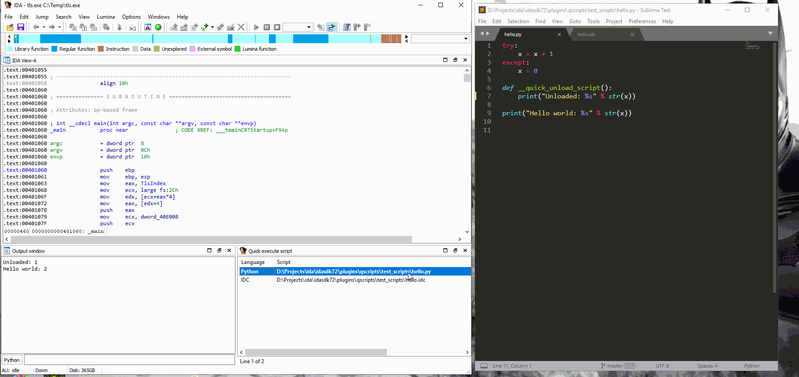
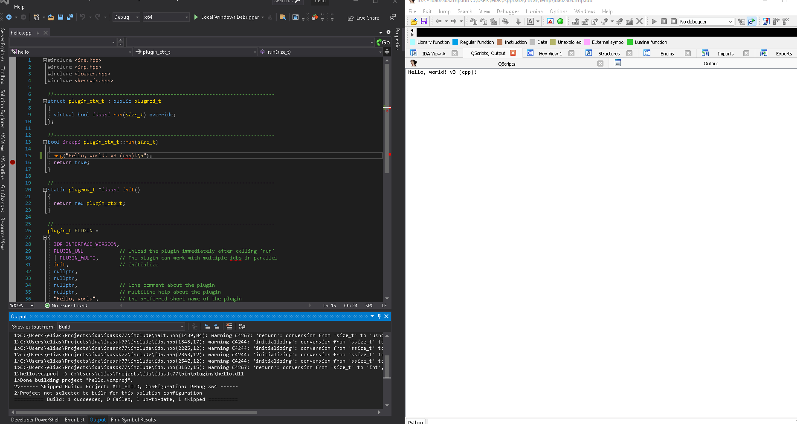

# What is QScripts?

QScripts is productivity tool and an alternative to IDA's "Recent scripts" (Alt-F9) and "Execute Scripts" (Shift-F2) facilities. QScripts allows you to develop and run any supported scripting language (\*.py; \*.idc, etc.) from the comfort of your own favorite text editor as soon as you save the active script, the trigger file or any of its dependencies. QScripts also supports hot-reloading of native plugins (loaders, processor modules, and plugins) using trigger files, enabling rapid development of compiled IDA addons.



Video tutorials on the [AllThingsIDA](https://www.youtube.com/@allthingsida) YouTube channel:

- [Boost your IDA programming efficiency tenfold using the ida-qscripts productivity plugin](https://youtu.be/1UEoLAgEGMc?si=YMieIKHEY0AXgMHU)
- [Scripting concepts and productivity tips for IDAPython & IDC](https://youtu.be/RgHmwHN0NLk?si=OCnLMhcAmHAQPgNI)
- [An exercise in netnodes with the snippet manager plugin](https://youtu.be/yhVdLYzFJW0?si=z3xMqCEFOU89gAkI)

# Usage

Invoke QScripts from the plugins menu, or its default hotkey Alt-Shift-F9.
When it runs, the scripts list might be empty. Just press `Ins` and select a script to add, or press `Del` to delete a script from the list.
QScripts shares the same scripts list as IDA's `Recent Scripts` window.

To execute a script, just press `ENTER` or double-click it. After running a script once, it will become the active script (shown in **bold**).

An active script will then be monitored for changes. If you modify the script in your favorite text editor and save it, then QScripts will execute the script for you automatically in IDA.

To deactivate the script monitor, just press `Ctrl-D` or right-click and choose `Deactivate script monitor` from the QScripts window. When an active script becomes inactive, it will be shown in *italics*.

## Keyboard shortcuts

Inside QScripts window:
* `Alt-Shift-F9`: Open QScripts window
* `ENTER` or double-click: Activate and execute selected script
* `Shift-Enter`: Execute selected script without activating it
* `Ins`: Add a new script to the list
* `Del`: Remove a script from the list
* `Ctrl-E`: Open options dialog
* `Ctrl-D`: Deactivate script monitor

From anywhere in IDA:
* `Alt-Shift-X`: Re-execute the last active script or notebook cell

## Configuration options

Press `Ctrl+E` or right-click and select `Options` to configure QScripts:

* Clear message window before execution: clear the message log before re-running the script. Very handy if you to have a fresh output log each time.
* Show file name when execution: display the name of the file that is automatically executed
* Execute the unload script function: A special function, if defined in the global scope (usually by your active script), called `__quick_unload_script` will be invoked before reloading the script. This gives your script a chance to do some cleanup (for example to unregister some hotkeys)
* Script monitor interval: controls the refresh rate of the script change monitor. Ideally 500ms is a good amount of time to pick up script changes.
* Allow QScripts execution to be undo-able: The executed script's side effects can be reverted with IDA's Undo.

# Managing Dependencies in QScripts

QScripts offers a feature that allows automatic re-execution of the active script when any of its dependent scripts, undergo modifications.

## Setting Up Automatic Dependencies

To leverage the automatic dependency tracking feature, create a file named identically to your active script, appending `.deps.qscripts` to its name. This file should contain paths to dependent scripts, along with any necessary reload directives.

Alternatively, you can place a `.deps` file (without the `.qscripts` suffix) within a `.qscripts` subfolder, located alongside your active script.

**Example locations for `script.py`:**
* `script.py.deps.qscripts` (same directory)
* `.qscripts/script.py.deps.qscripts` (local folder)
* `.qscripts/script.py.deps` (local folder, alternate name)

## Dependency Index File Syntax

The dependency index file supports comments and directives:

```txt
# Python-style comments
; Semicolon comments
// C-style comments

/reload import importlib; import $basename$; importlib.reload($basename$);
dependency1.py
dependency2.py
```

## Integrating Python Scripts

For projects involving Python, QScripts can automatically [reload](https://docs.python.org/3/library/importlib.html#importlib.reload) any changed dependent Python scripts. Include a `/reload` directive in your `.deps.qscripts` file, followed by the appropriate Python reload syntax.

### Example `.deps.qscripts` file for `t1.py`:

```txt
/reload import importlib; import $basename$; importlib.reload($basename$);
t2.py
# This is a comment
t3.py
```

The `t1.py.deps.qscripts` configuration enables the following behavior:

1. **Script Auto-Execution**: Changes to `t1.py` trigger its automatic re-execution within the IDA environment.
2. **Dependency Reload**: Modifications to the dependency index file (`t1.py.deps.qscripts`) lead to the reloading of specified dependencies, followed by the re-execution of the active script.
3. **Dependency Script Changes**: Any alteration in a dependency script file causes the active script to re-execute. If a reload directive is present, the modified dependency files are also reloaded. In our cases, if either or both of `t2.py` and `t3.py` are modified, `t1.py` is re-executed and the modified dependencies are reloaded as well.

**Note**: If a dependent script possesses its own `.deps.qscripts` file, QScripts recursively integrates all linked dependencies into the active script's dependencies. However, specific directives (e.g., `reload`) within these recursive dependencies are disregarded.

See also:

* [Simple dependency example](test_scripts/dependency-test/README.md)
* [Package dependency example](test_scripts/pkg-dependency/README.md)

## Directive Reference

Directives must appear at the beginning of a line and start with `/`. Arguments follow the directive name.

### `/reload <code>`

Executes the specified code snippet when a dependency is modified, before re-executing the main script. The code is executed in the context of the dependency's language interpreter.

```txt
/reload import importlib; import $basename$; importlib.reload($basename$);
```

### `/pkgbase <path>`

Specifies a package base directory for Python package dependencies. This path is used in conjunction with `$pkgmodname$` and `$pkgparentmodname$` variables.

```txt
/pkgbase C:\projects\mypackage
```

### `/triggerfile [/keep] <filepath>`

Configures QScripts to execute the script when the specified trigger file is created or modified, rather than when the script itself changes. This is particularly useful for hot-reloading compiled native plugins.

Options:
* `/keep`: Preserve the trigger file after execution (default behavior is to delete it)

```txt
/triggerfile /keep C:\temp\build_done.flag
```

### `/notebook [<title>]`

Enables notebook mode where a directory of scripts is treated as a collection of cells. When any file matching the cell pattern is saved, that cell is executed.

```txt
/notebook My Analysis Notebook
```

### `/notebook.cells_re <regex>`

Specifies a regular expression pattern to identify notebook cell files. The default pattern is `\d{4}.*\.py$`.

```txt
/notebook.cells_re ^\d{4}_.+\.py$
```

### `/notebook.activate <action>`

Controls the behavior when the notebook is activated:
* `exec_none`: Display the notebook title but do not execute any scripts
* `exec_main`: Execute the main script file
* `exec_all`: Execute all notebook cells in order

```txt
/notebook.activate exec_all
```

## Special Variables

Variables are expanded when encountered in file paths or reload directives. Use the syntax `$variable$`.

* `$basename$`: The base name (without extension) of the current dependency file
* `$env:VariableName$`: The value of the environment variable `VariableName`
* `$pkgbase$`: The package base directory (set via `/pkgbase`)
* `$pkgmodname$`: The module name derived from the dependency file path relative to `$pkgbase$`, with path separators replaced by dots (e.g., `pkg.submodule.file`)
* `$pkgparentmodname$`: The parent module name (e.g., `pkg.submodule`)
* `$ext$`: The platform-specific plugin extension (e.g., `64.dll`, `.so`, `64.dylib`)

### Examples

```txt
# Reload a Python module
/reload import importlib; import $basename$; importlib.reload($basename$);

# Use environment variable in path
$env:SCRIPTS_DIR$/helper.py

# Package reloading
/pkgbase C:\myproject\src
/reload import importlib; import $pkgmodname$; importlib.reload($pkgmodname$);
src/utils/helper.py
```

# Using QScripts like a Jupyter notebook

QScripts can monitor a directory of script files as if they were notebook cells. When you save any file matching the cell pattern, that cell is executed.

**Example notebook configuration for `notebook.py.deps.qscripts`:**

```txt
/notebook Data Analysis Notebook
/notebook.cells_re ^\d{4}_.+\.py$
/notebook.activate exec_none
/reload import importlib; import $basename$; importlib.reload($basename$);
shared_utils.py
```

With this configuration:
* Files like `0010_load_data.py`, `0020_process.py`, `0030_visualize.py` are recognized as cells
* Saving any cell executes only that cell
* The notebook title is displayed when activated
* Changes to `shared_utils.py` cause the last-executed cell to re-run

See also:

* [Notebooks dependency example](test_scripts/notebooks/README.md)

# Using QScripts with trigger files

Sometimes you don't want to trigger QScripts when your scripts are saved, instead you want your own trigger condition.
One way to achieve a custom trigger is by using the `/triggerfile` directive:

```
/triggerfile createme.tmp

; Dependencies...
dep1.py
```

This tells QScripts to wait until the trigger file `createme.tmp` is created (or modified) before executing your script. Now, any time you want to execute the active script, just create (or modify) the trigger file.

You may pass the `/keep` option so QScripts does not delete your trigger file:

```
/triggerfile /keep dont_del_me.info
```

# Using QScripts programmatically

QScripts can be controlled programmatically from scripts or other plugins.

## Plugin Arguments

```python
# Open QScripts window
idaapi.load_and_run_plugin("qscripts", 0)

# Execute the last selected script
idaapi.load_and_run_plugin("qscripts", 1)

# Activate the script monitor
idaapi.load_and_run_plugin("qscripts", 2)

# Deactivate the script monitor
idaapi.load_and_run_plugin("qscripts", 3)
```

## Action IDs

QScripts registers the following actions that can be invoked programmatically:

* `qscripts:deactivatemonitor` - Deactivate the script monitor
* `qscripts:execselscript` - Execute the selected script without activating it
* `qscripts:execscriptwithundo` - Re-execute the last active script or notebook cell
* `qscripts:executenotebook` - Execute all cells in the active notebook

```python
# Re-execute the active script
idaapi.process_ui_action("qscripts:execscriptwithundo")

# Execute all notebook cells
idaapi.process_ui_action("qscripts:executenotebook")
```

# Hot-Reloading Native Plugins

QScripts supports hot-reloading of compiled native plugins (IDA plugins, loaders, and processor modules) using trigger files. This enables rapid iterative development of native IDA addons without restarting IDA.



## Requirements

The native plugin must be designed to support unloading:
* **Plugins**: Set the `PLUGIN_UNL` flag to allow IDA to unload the plugin after each invocation
* **Loaders**: Loaders are naturally unloadable
* **Processor modules**: Use appropriate cleanup in module termination

## Workflow

The hot-reload workflow uses trigger files to detect when a new binary is available:

1. Create a loader script that invokes your native plugin
2. Configure a dependency file with `/triggerfile` pointing to the compiled binary
3. Build your native plugin
4. QScripts detects the binary change and executes the loader script
5. The loader script invokes the newly compiled plugin

## Example: Hot-Reloading a Plugin

For a plugin with the `PLUGIN_UNL` flag (like the IDA SDK `hello` sample):

**Step 1**: Create a loader script `load_hello.py`:

```python
# Optionally clear the screen
idaapi.msg_clear()

# Load your plugin and pass any arg value you want
idaapi.load_and_run_plugin('hello', 0)

# Optionally, do post work, etc.
# ...
```

**Step 2**: Create the dependency file `load_hello.py.deps.qscripts`:

```
/triggerfile /keep C:\<ida_dir>\plugins\hello$ext$
```

**Step 3**: Activate `load_hello.py` in QScripts (press `ENTER` on it)

**Step 4**: Build or rebuild the plugin in your IDE

The moment the compilation succeeds, the new binary will be detected (since it is the trigger file) and your loader script will use IDA's `load_and_run_plugin()` to run the plugin again.

## Example: Hot-Reloading a Loader

For loaders, the workflow is similar but uses `load_file()` instead:

**Loader script `test_loader.py`:**

```python
idaapi.msg_clear()

# Unload the old loader if needed
# (IDA handles this automatically for loaders)

# Load a test file with your loader
idaapi.load_file("C:\\testfiles\\myformat.bin", 0)
```

**Dependency file `test_loader.py.deps.qscripts`:**

```
/triggerfile /keep C:\<ida_dir>\loaders\myloader$ext$
```

## Using $ext$ Variable

The `$ext$` variable automatically expands to the platform-specific plugin extension:
* Windows 64-bit: `64.dll`
* Windows 32-bit: `.dll`
* Linux 64-bit: `64.so`
* Linux 32-bit: `.so`
* macOS: `64.dylib` or `.dylib`

This allows your dependency files to work across platforms without modification.

## Additional Examples

Please check the native addons examples in [test_addons](test_addons/) for complete working examples of hot-reloading plugins, loaders, and processor modules.

# Building

QScripts is built with [ida-cmake](https://github.com/allthingsida/ida-cmake) and uses [idacpp](https://github.com/allthingsida/libidacpp).

**Requirement:** install **ida-cmake** into your IDA SDK (`$IDASDK/ida-cmake`). See the [ida-cmake README](https://github.com/allthingsida/ida-cmake) for how to set that up — QScripts does not duplicate IDA SDK setup here. `idacpp` is resolved automatically: from your SDK (`$IDASDK/include/idacpp`) if present, otherwise fetched from [libidacpp](https://github.com/allthingsida/libidacpp) (or point at a local checkout with `-DIDACPP_PATH=<path>`).

```bash
cmake -B build
cmake --build build --config Release
```

Supported IDA SDK versions: **9.2, 9.3, 9.4**. For Windows-on-ARM, cross-build with `cmake -B build -A ARM64` (requires SDK 9.4+).

If you don't want to build from source, prebuilt binaries are on the releases page.

# Installation

QScripts is written in C++ with IDA's SDK and therefore it should be deployed like a regular plugin. Copy the plugin binaries to either of those locations:

* `<IDA_install_folder>/plugins`
* `%APPDATA%\Hex-Rays/plugins`

Since the plugin uses IDA's SDK and no other OS-specific functions, it builds for Windows (x64 and ARM64), Linux, and macOS. Prebuilt binaries are on the [releases page](https://github.com/allthingsida/qscripts/releases).

# BONUS

## Snippet Manager

QScripts ships with a simple [Snippet Manager](snippet_manager/README.md) plugin to allow you to manage script snippets.

# License

QScripts is licensed under the **Human-Origin Source License v1.0** (source-available). See [`LICENSE`](LICENSE) and the per-file `SPDX-License-Identifier: LicenseRef-Human-Origin-Source-1.0` headers. Copyright (c) 2019-2026 Elias Bachaalany. (Previously MIT.)
